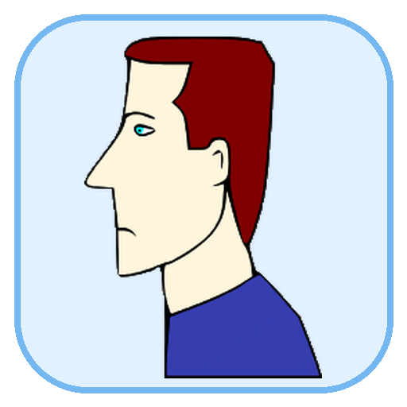
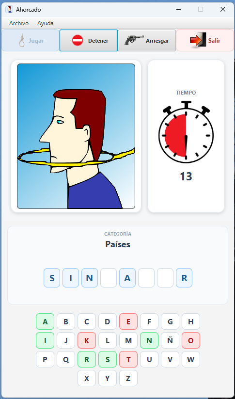
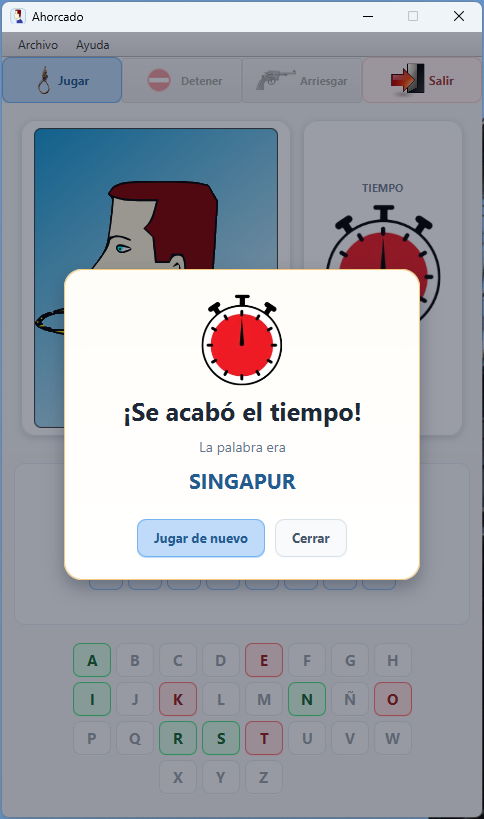

<p align="center">
  
</p>

<h1 align="center">Ahorcado</h1>

<p align="center">
  El clásico juego del ahorcado, renovado para escritorio.
</p>

<p align="center">
  <strong>Versión 1.0.0</strong> · Windows · Linux
</p>

---

## Sobre el juego

**Ahorcado** es una versión de escritorio del clásico juego de palabras, desarrollada en Java y JavaFX.

El objetivo es descubrir la palabra o frase antes de agotar los intentos o el tiempo disponible. La aplicación funciona completamente **offline** y cuenta con distintas categorías, sonidos, animaciones y opciones de configuración.

## Características

- Más de **500 palabras y nombres** incluidos.
- Cuatro categorías:
  - Países
  - Ciudades
  - Marcas de autos
  - Bandas de Rock
- Tiempo configurable: **15, 30, 45 o 60 segundos**.
- Posibilidad de seleccionar letras o **arriesgar la respuesta completa**.
- Manejo de acentos, diéresis, eñes y otros caracteres especiales.
- Sonidos para errores, victoria y derrota.
- Animaciones e interfaz gráfica moderna.
- Preferencias persistentes entre partidas.
- Ayuda integrada dentro de la aplicación.
- Base de datos SQLite incluida.
- Funcionamiento completamente offline.
- No requiere tener Java instalado en la computadora del usuario.

## Capturas de pantalla

<p align="center">
  
</p>

<p align="center">
  <em>Pantalla principal del juego.</em>
</p>

<br>

<p align="center">
  
</p>

<p align="center">
  <em>Partida con límite de tiempo configurable.</em>
</p>

## Descargas

Las versiones compiladas se publican en la sección **Releases** del repositorio.

### Windows

Disponible como instalador `.exe` autocontenido.

El instalador incluye el runtime necesario, por lo que **no es necesario instalar Java**.

### Linux

Disponible en dos formatos:

- paquete `.deb` para Debian, Ubuntu, Linux Mint y distribuciones derivadas;
- versión portable `.tar.gz`.

Ambas versiones incluyen su propio runtime Java.

## Compilar desde el código fuente

### Requisitos generales

- JDK 17
- Maven Wrapper incluido en el proyecto

### Windows

Para generar la versión portable y el instalador:

```bat
00-verificar-requisitos.bat
01-crear-portable.bat
02-crear-instalador.bat
```

También puede realizarse todo el proceso con:

```bat
build-windows.bat
```

Para generar el instalador de Windows se utiliza **WiX Toolset 3.14**.

### Linux

Dar permisos de ejecución a los scripts:

```bash
chmod +x *.sh mvnw
```

Luego:

```bash
./00-verificar-requisitos-linux.sh
./01-crear-portable-linux.sh
./02-crear-deb.sh
```

También puede realizarse todo el proceso con:

```bash
./build-linux.sh
```

Para generar el paquete `.deb` se requieren las herramientas estándar de empaquetado de Debian, incluyendo `dpkg-deb` y `fakeroot`.

## Tecnologías utilizadas

- Java 17
- JavaFX
- SQLite
- Maven
- jpackage
- WiX Toolset
- CSS

## Estructura principal

```text
src/
├── main/
│   ├── java/
│   │   └── com/llorieb/ahorcado/
│   └── resources/
│       ├── css/
│       ├── images/
│       ├── sonidos/
│       ├── AhorcadoLayout.fxml
│       └── ahorcado.db
```

## Autor

**Mario Borelli**

Copyright © 1996–2026 Mario Borelli
